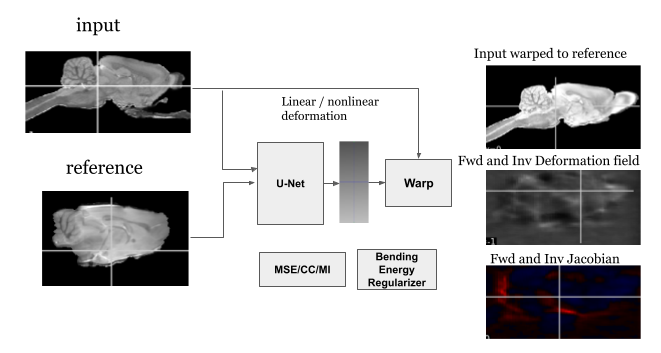

# rodreg: Rodent Brain Registration

This project is focused on the registration of rodent brain images using various techniques and tools.
`rodreg` is a registration method that uses convolutional neural networks (CNNs) to generate a deformation field as the output from input moving (A) and reference (B) images.  The input images are passed into the CNN, which produces a deformation field (mapping) between A and B. We note that `rodreg` does not require the CNN to be pre-trained but uses the neural network to create a deformation field uniquely specific to A and B. An advantage of this technique is the accelerated computation time, which is made possible by leveraging the efficiency of PyTorch. This method can be optimized using various cost functions that assess the similarities between A and B, such as cross-correlation and mutual information. The deformation field is regularized by adding bending energy regularize to the selected cost function.

<p align="center">
  
</p>

## Quick Summary

This repository contains scripts and notebooks for performing image registration on rodent brain images. The project utilizes tools such as SimpleITK, Nilearn, and MONAI for image processing and registration tasks.

## Project Structure


## Installation

Install the required dependencies using the `requirements.txt` file:

```sh
pip install -r requirements.txt
```

## Usage
Run the script from the command line:

```bash
python run_rodreg.py [options]
```

### Options
- -i: Input subject file (required)
- -r: Reference image file prefix (required)
- --o: Output file name for non-linearly warped image (required)
- --l: Output label file name (required)
- --j: Output inverse jacobian file name (optional)
- --linloss: Loss function for linear registration (default: 'cc', choices: 'mse', 'cc', 'mi')
- --nonlinloss: Loss function for non-linear registration (default: 'cc', choices: 'mse', 'cc', 'mi')
- --le: Maximum iterations for linear registration (default: 1500)
- --ne: Maximum iterations for non-linear registration (default: 5000)
- --d or --device: Computation device (default: "cuda")


### Configuration
Ensure that the paths to the input images and atlases are correctly set in the scripts and notebooks.


### Usage
Use the Jupyter notebooks for interactive exploration and registration tasks.
Run the scripts for batch processing and automated registration.
Example command to run a script:

```
python run_rodreg.py -i input_image.nii.gz -r reference_image_prefix --o output_image.nii.gz --l output_label.nii.gz
```


